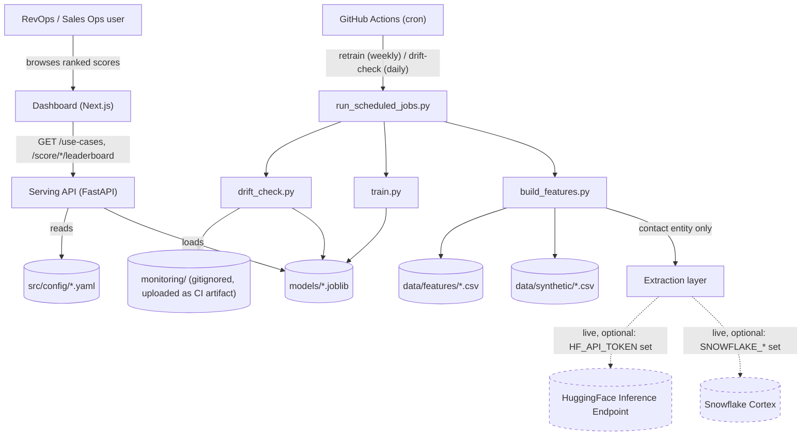
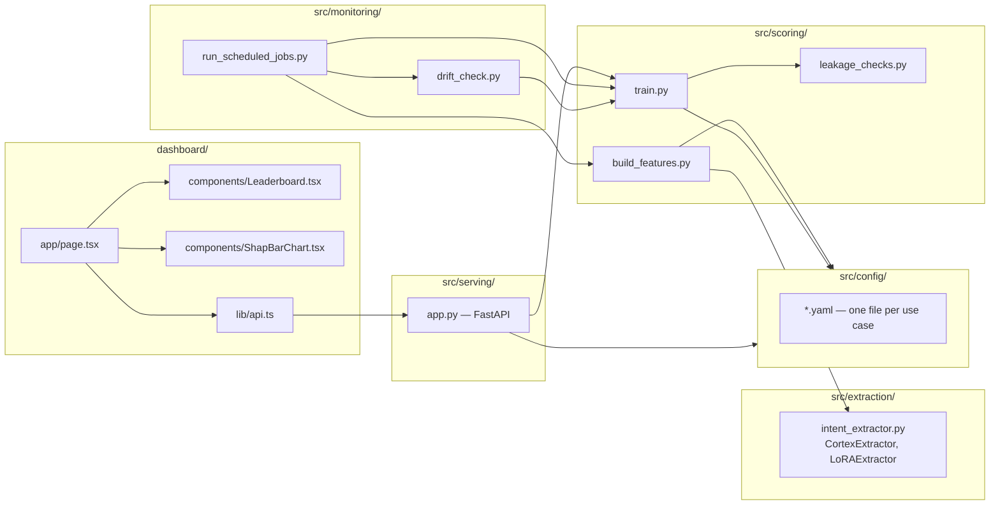
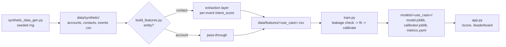
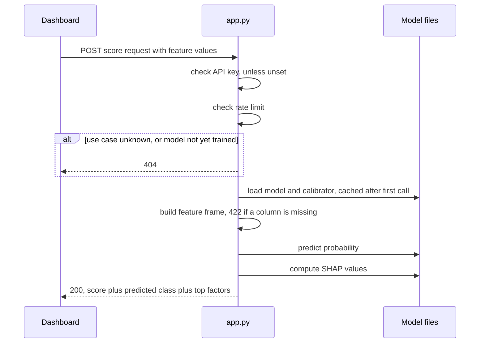
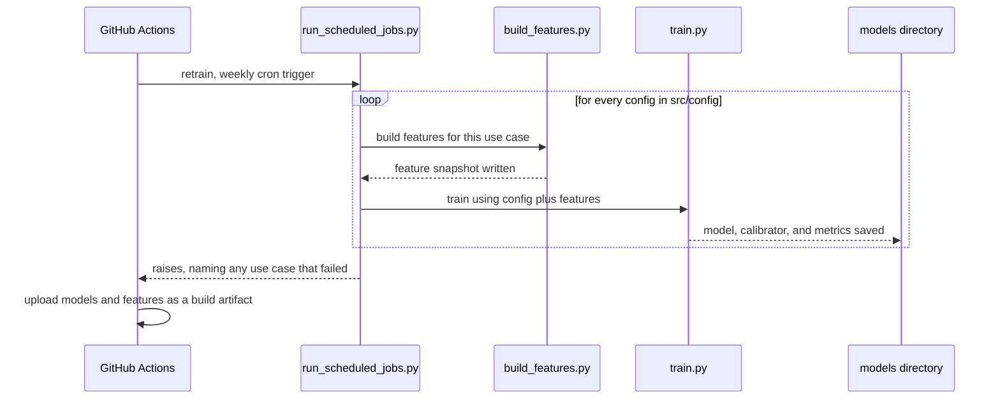

# Architecture — PathScore AI

Companion to [PRD.md](PRD.md) (what/why), [TDD.md](TDD.md) (implementation
detail), and the [ADRs](adr/README.md) (why each major choice, and what else
was considered). This document is the system view: components, data flow, and
the two request paths that matter most.

## 1. System context

Who and what this system talks to — the dashboard is the only real client;
Snowflake and HuggingFace are optional, credential-gated live dependencies that
degrade to local mocks when unconfigured
([ADR-0006](adr/0006-env-driven-mock-live-clients.md)).

Dashed edges are the live paths that require credentials this repo doesn't
ship; solid edges run unconditionally in local dev.

## 2. Component map

`train.py` and `leakage_checks.py` import each other with bare module names
(run as scripts, not a package) — `sys.path` insertion in `drift_check.py`,
`build_features.py`, and `run_scheduled_jobs.py` is what lets them share
`train.py`'s functions without restructuring `src/` into a formal package.

## 3. Data flow: synthetic data to a servable model

## 4. Sequence: `POST /score/{use_case}`

## 5. Sequence: scheduled retrain

Models upload as a build artifact rather than being auto-committed — a human
reviews and commits deliberately, same as any other repo change
([ADR-0007](adr/0007-github-actions-cron-scheduling.md)).

## 6. Deployment view

Current state: **local only**. No component in this diagram is deployed
anywhere; `.github/workflows/retrain.yml` is dormant until this repo is pushed
to GitHub with Actions enabled. See [DEPLOYMENT.md](DEPLOYMENT.md) for the
recommended target topology and why it hasn't been executed.

## Where each ADR fits

| Diagram element | Decision record |
|---|---|
| LightGBM inside `train.py` | [ADR-0001](adr/0001-lightgbm-over-neural-net.md) |
| Extraction layer's live/mock split | [ADR-0002](adr/0002-lora-over-full-finetuning.md), [ADR-0003](adr/0003-cortex-first-lora-fallback.md), [ADR-0006](adr/0006-env-driven-mock-live-clients.md) |
| One `app.py`/`train.py` for every use case | [ADR-0004](adr/0004-config-driven-single-pipeline.md) |
| `data/features/*.csv` | [ADR-0005](adr/0005-flat-csv-feature-snapshots.md) |
| GitHub Actions scheduler | [ADR-0007](adr/0007-github-actions-cron-scheduling.md) |
| `API_KEY`/rate limit in `app.py` | [ADR-0008](adr/0008-api-key-rate-limit-over-full-auth.md) |
| Dashboard test tooling | [ADR-0009](adr/0009-vitest-over-jest.md) |
| E2E scope | [ADR-0010](adr/0010-single-e2e-golden-path.md) |
