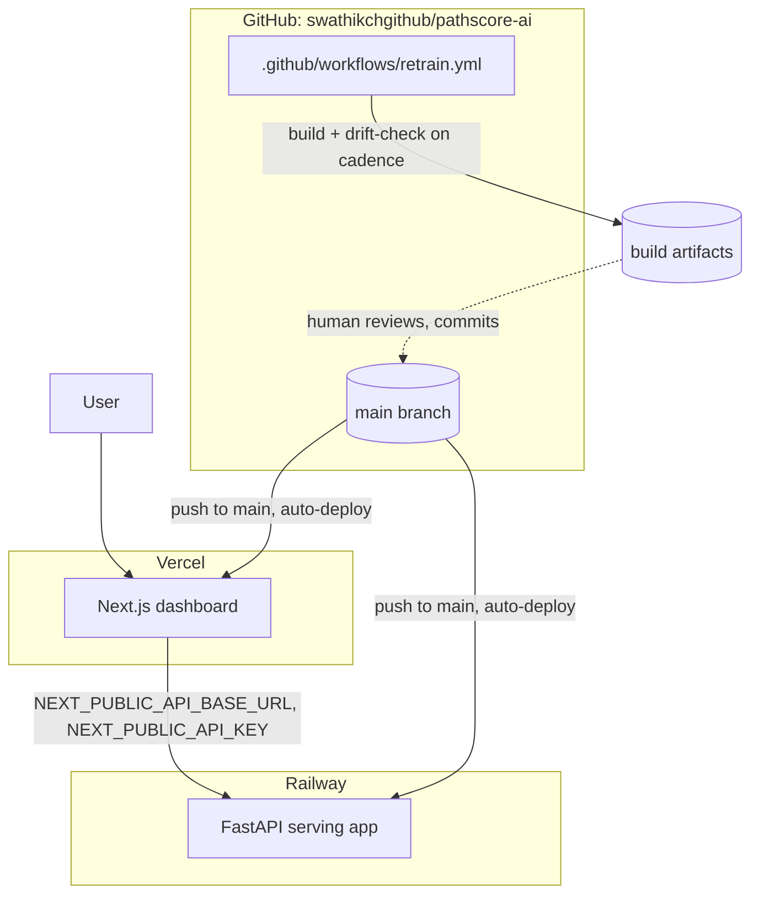

# Deployment Strategy

## Current state: deployed, matching the target topology

- **API**: https://api-production-c80d.up.railway.app — Railway, project `pathscore-ai`
- **Dashboard**: https://pathscore-ai-dashboard.vercel.app — Vercel, project `pathscore-ai-dashboard`

Both are connected to `github.com/swathikchgithub/pathscore-ai` and auto-deploy
on push to `main` — this is the actual target topology below, not a
substitution. (An earlier iteration put the dashboard on Railway too, since
that was the only platform with tooling available at first deploy; it was
migrated to Vercel once that changed, and the Railway `dashboard` service was
deleted rather than left running as a stale duplicate.)

`.github/workflows/retrain.yml` is live too — this repo is on GitHub with
Actions enabled, so its weekly retrain / daily drift-check cron actually
fires ([ADR-0007](adr/0007-github-actions-cron-scheduling.md)).

### What it took to get a clean deploy

Three real issues came up, all fixed via platform config rather than app code:

1. **`libgomp.so.1: cannot open shared object file`** (Railway) — LightGBM's
   native library needs the GNU OpenMP runtime, absent from Railway's default
   Railpack Python image. Fixed with a service variable:
   `RAILPACK_DEPLOY_APT_PACKAGES=libgomp1`.
2. **Monorepo root-directory double-scoping** (both platforms, same shape) —
   once a service/project has `rootDirectory: dashboard` set (needed for a
   GitHub-triggered build, which clones the *whole* repo), a *local* CLI
   deploy already scoped to that same subdirectory (`railway up` run from
   inside `dashboard/`, or `vercel deploy` from a directory linked from
   inside it) gets double-scoped to a nonexistent `dashboard/dashboard/`.
   Fixed by deploying from the repo root once `rootDirectory` is set, letting
   that setting do the subdirectory scoping itself, rather than scoping
   twice.
3. **CORS allowlist tied to one specific origin** — `CORS_ORIGINS` names an
   exact origin, so it had to be updated (and the API redeployed) each time
   the dashboard's public URL changed — Railway's generated domain, then
   Vercel's. Worth knowing if the dashboard's URL ever changes again (a
   custom domain, say): the API's `CORS_ORIGINS` needs updating too.

Full working configuration, for reproducing this from a fresh setup:

| | API (Railway) | Dashboard (Vercel) |
|---|---|---|
| Source | GitHub repo, branch `main`, root directory unset (repo root) | GitHub repo, branch `main`, root directory `dashboard` |
| Start/build command | `uvicorn src.serving.app:app --host 0.0.0.0 --port $PORT` | auto-detected (Next.js: `next build` / `next start`) |
| Variables | `API_KEY`, `RAILPACK_DEPLOY_APT_PACKAGES=libgomp1`, `CORS_ORIGINS=<dashboard domain>` | `NEXT_PUBLIC_API_BASE_URL=<api domain>`, `NEXT_PUBLIC_API_KEY=<same value as API_KEY>` |

`NEXT_PUBLIC_*` vars are baked in at Next.js build time, so the API needs its
public domain *before* the dashboard's first build for the URL to be
correct — and any later change to either domain needs both a dashboard
rebuild (new `NEXT_PUBLIC_API_BASE_URL`) and an API redeploy (new
`CORS_ORIGINS`).

## Target topology (deployed as of this writing)

### Dashboard → Vercel

Next.js App Router deploys to Vercel with effectively zero configuration
(it's the reference platform for the framework); free tier is sufficient for
a demo, and PR preview deployments come for free — useful for reviewing a
dashboard change before it merges.

### API → Railway or Fly.io

Both handle a single lightweight, mostly-CPU Python process well and cheaply.
Railway is what's actually deployed; no `Dockerfile` was needed in practice —
Railway's Railpack builder auto-detects the Python app from `requirements.txt`
and just needed an explicit `deploy.startCommand` (see above) plus one apt
package (`libgomp1`, for LightGBM). Railway specifically has first-class
managed cron jobs, which is the natural place to eventually move the
retrain/drift-check schedule if that's ever preferred over GitHub Actions —
not required, worth revisiting only if GitHub Actions minutes become a
constraint.

### Models → stay in the container image

`models/*.joblib` are small (a few hundred KB to low single-digit MB each
today). Shipping them inside the API's container image is simpler than
external object storage (S3/GCS) and keeps model version = code version =
one deployable artifact. Revisit only if a use case's model grows large
enough that image size or build time becomes a real problem — not the case
today.

### Secrets

`SNOWFLAKE_*`, `HF_API_TOKEN`, `API_KEY`, `RATE_LIMIT_PER_MINUTE`,
`CORS_ORIGINS` as platform-native secret/environment variables on whichever
host runs the API; `NEXT_PUBLIC_API_KEY`/`NEXT_PUBLIC_API_BASE_URL` as
Vercel environment variables for the dashboard. The local `.gitignore`/
`.env.example` split already establishes the discipline this carries
forward: nothing secret is ever committed, `.env.example` documents every
variable with no real values.

## CI/CD

Two pieces exist today, both GitHub-triggered, neither gated on the other:

1. **Deploy, on every push to `main`**: both Railway (API) and Vercel
   (dashboard) are connected directly to the repo and rebuild automatically
   — no custom workflow needed for this half; it's the platforms' own native
   git integration.
2. **Scheduled retrain/drift-check**: `.github/workflows/retrain.yml`, on its
   own cadence, independent of pushes.

What's still missing, and would be the natural next addition: a **test gate**
before deploy. Right now a push to `main` that breaks `pytest tests/` or
`npm test` still deploys — Railway/Vercel build and ship whatever's on
`main`, they don't run this repo's test suite first. A CI workflow running
`pytest tests/`, `npm test`, and `npm run build` (dashboard) on every PR,
required to pass before merge, would close that gap using the same checks
this project already runs locally before every commit — just automated and
enforced.

Scheduled retrain results (currently uploaded as a build artifact by
`retrain.yml`) could also gain a manual "promote" step — a human downloads
and reviews the artifact, commits the updated model, which then deploys like
any other change to `main`. This keeps model updates behind the same review
gate as code, deliberately not an automatic model rollout
([ADR-0007](adr/0007-github-actions-cron-scheduling.md)).

## Environments

No staging/prod split exists or is currently needed — a single demo
deployment is sufficient at this scale. If this became a real internal tool,
the natural split is a permanent prod pair (dashboard + API, reading
committed prod models) plus per-PR preview environments — Vercel gives this
for the dashboard automatically; the API would need an equivalently cheap
ephemeral environment (Railway and Fly both support PR/branch environments).

## Rollback

- **Models:** committed to git, so rollback is `git revert` on the commit
  that updated them — no separate model registry needed at this scale.
- **API/dashboard:** standard platform rollback (redeploy the previous
  successful build) on both Vercel and Railway/Fly — no custom tooling
  needed.

## Observability (not yet built)

- **API:** currently only uvicorn's default access logs. A real deployment
  should add structured request logs (use case, status, latency) shipped
  somewhere queryable (even just the hosting platform's own log search is a
  reasonable start).
- **Drift:** `monitoring/dashboard.md` (gitignored locally, uploaded as a CI
  artifact per scheduled run) is the only current monitoring surface. A real
  deployment would want this posted somewhere durable and visible without
  downloading an artifact — a Slack post, a status page, or committing it to
  a docs site are all reasonable next steps, none implemented yet.
- **Alerting:** none exists. The `drifted: true` field `drift_check.py`
  already computes is the natural trigger for one, whenever this is wired to
  a real notification channel.
