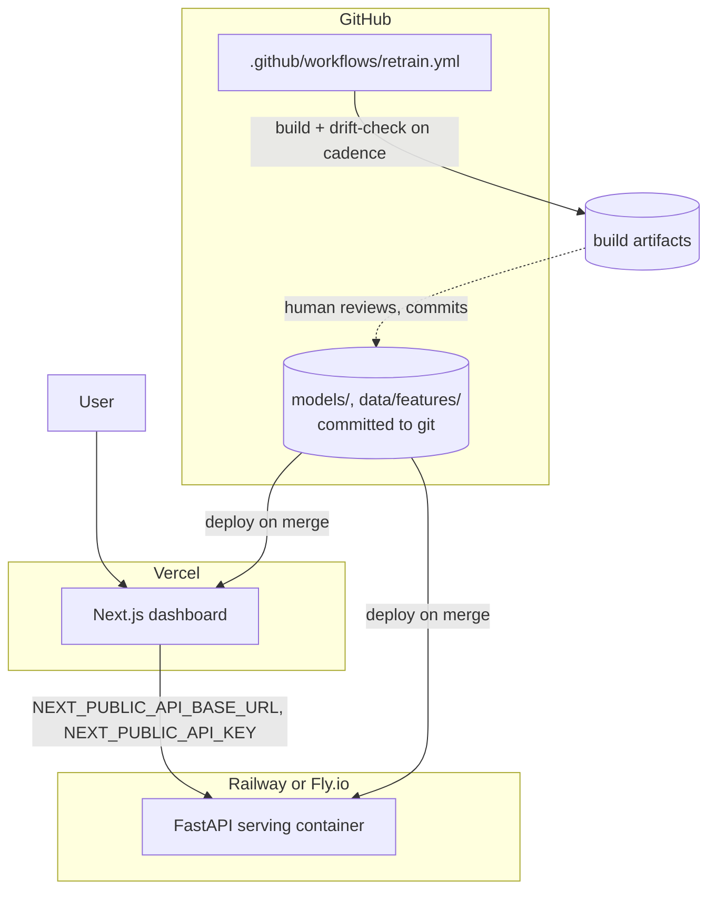

# Deployment Strategy

## Current state: local only

Nothing in this system is deployed anywhere. `.github/workflows/retrain.yml`
exists but is dormant until this repo is pushed to GitHub with Actions
enabled — the file describes a scheduler, it doesn't run one on its own
([ADR-0007](adr/0007-github-actions-cron-scheduling.md)). This document
describes the recommended path to a real deployment; executing it is a
separate, deliberate decision for whoever owns this repo, not something
implied by writing it down.

## Target topology

### Dashboard → Vercel

Next.js App Router deploys to Vercel with effectively zero configuration
(it's the reference platform for the framework); free tier is sufficient for
a demo, and PR preview deployments come for free — useful for reviewing a
dashboard change before it merges.

### API → Railway or Fly.io

Both handle a single lightweight, mostly-CPU Python process well and cheaply.
Neither is chosen over the other here; either is a reasonable default. This
needs a `Dockerfile` (none exists yet) — a small `python:3.11-slim` base,
`pip install -r requirements.txt`, `uvicorn src.serving.app:app --host 0.0.0.0
--port $PORT`. Railway specifically has first-class managed cron jobs, which
is the natural place to eventually move the retrain/drift-check schedule if
this ever runs on Railway anyway, rather than keeping it on GitHub Actions —
not required for launch, worth revisiting once (if) that platform is chosen.

### Models → stay in the container image

`models/*.joblib` are small (a few hundred KB to low single-digit MB each
today). Shipping them inside the API's container image is simpler than
external object storage (S3/GCS) and keeps model version = code version =
one deployable artifact. Revisit only if a use case's model grows large
enough that image size or build time becomes a real problem — not the case
today.

### Secrets

`SNOWFLAKE_*`, `HF_API_TOKEN`, `API_KEY`, `RATE_LIMIT_PER_MINUTE`,
`CORS_ORIGINS` as platform-native secret/environment variables on whichever
host runs the API; `NEXT_PUBLIC_API_KEY`/`NEXT_PUBLIC_API_BASE_URL` as
Vercel environment variables for the dashboard. The local `.gitignore`/
`.env.example` split already establishes the discipline this carries
forward: nothing secret is ever committed, `.env.example` documents every
variable with no real values.

## CI/CD

`.github/workflows/retrain.yml` already exists for the retrain/drift cadence.
A deploy pipeline is a natural sibling, not yet added:

1. On every PR: run `pytest tests/`, `npm test`, `npm run build` (dashboard)
   — the same checks this repo already runs locally before every commit in
   this project's history, just automated.
2. On merge to `main`: build and push the API container, trigger a Vercel
   deploy for the dashboard (Vercel does this automatically once the repo is
   connected — no extra workflow step needed for that half).
3. Scheduled retrain results (currently uploaded as a build artifact) could
   gain a manual "promote" step — a human downloads/reviews the artifact,
   commits it, which then flows through step 2 like any other change. This
   keeps model updates behind the same review gate as code, deliberately not
   an automatic model rollout ([ADR-0007](adr/0007-github-actions-cron-scheduling.md)).

## Environments

No staging/prod split exists or is currently needed — a single demo
deployment is sufficient at this scale. If this became a real internal tool,
the natural split is a permanent prod pair (dashboard + API, reading
committed prod models) plus per-PR preview environments — Vercel gives this
for the dashboard automatically; the API would need an equivalently cheap
ephemeral environment (Railway and Fly both support PR/branch environments).

## Rollback

- **Models:** committed to git, so rollback is `git revert` on the commit
  that updated them — no separate model registry needed at this scale.
- **API/dashboard:** standard platform rollback (redeploy the previous
  successful build) on both Vercel and Railway/Fly — no custom tooling
  needed.

## Observability (not yet built)

- **API:** currently only uvicorn's default access logs. A real deployment
  should add structured request logs (use case, status, latency) shipped
  somewhere queryable (even just the hosting platform's own log search is a
  reasonable start).
- **Drift:** `monitoring/dashboard.md` (gitignored locally, uploaded as a CI
  artifact per scheduled run) is the only current monitoring surface. A real
  deployment would want this posted somewhere durable and visible without
  downloading an artifact — a Slack post, a status page, or committing it to
  a docs site are all reasonable next steps, none implemented yet.
- **Alerting:** none exists. The `drifted: true` field `drift_check.py`
  already computes is the natural trigger for one, whenever this is wired to
  a real notification channel.
